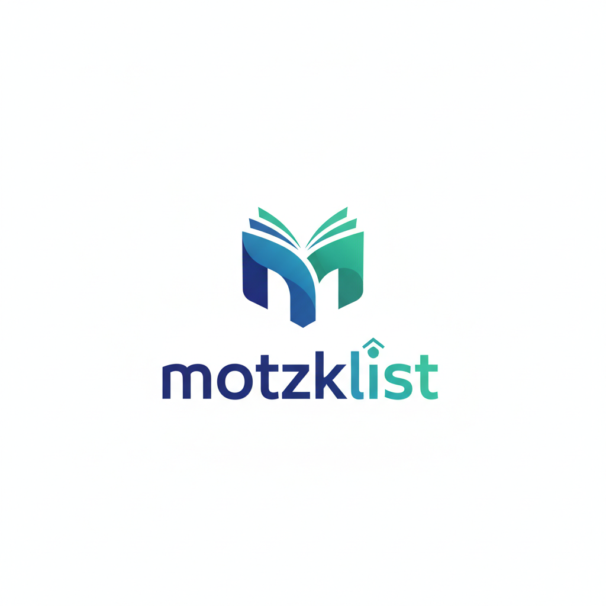
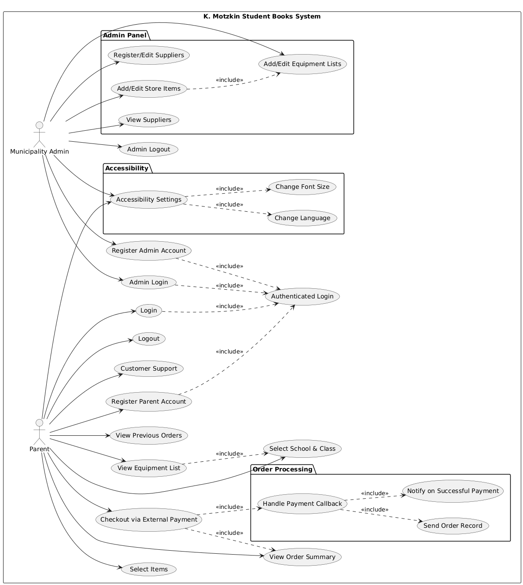
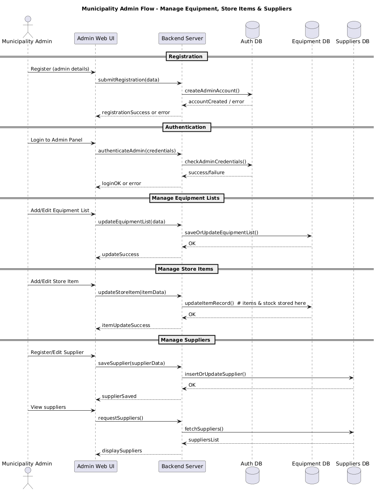
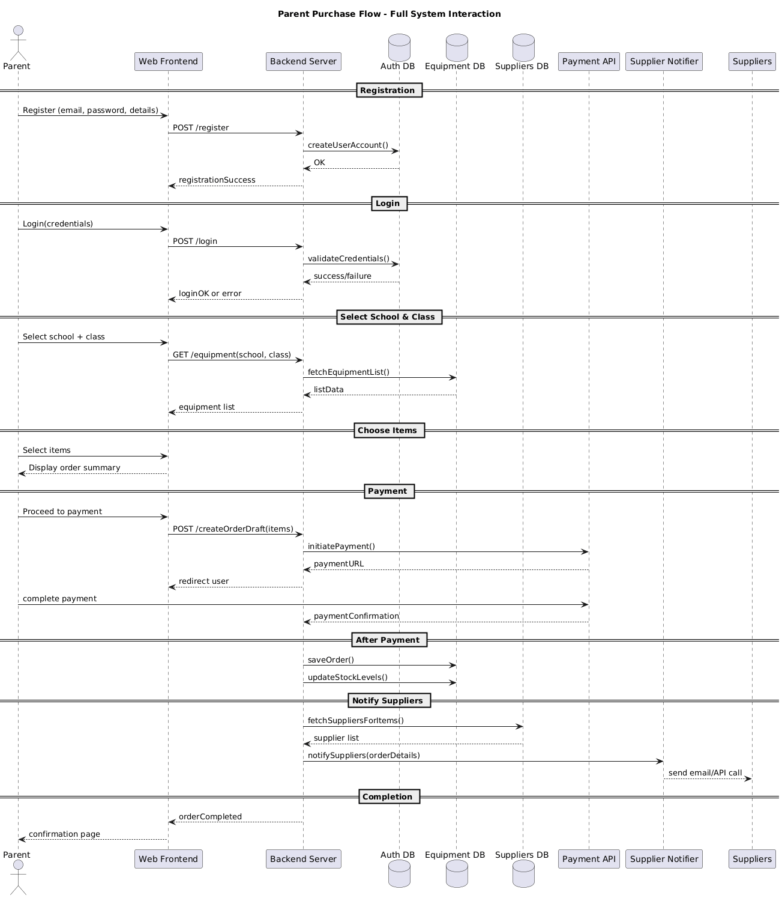
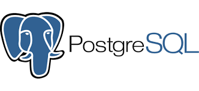
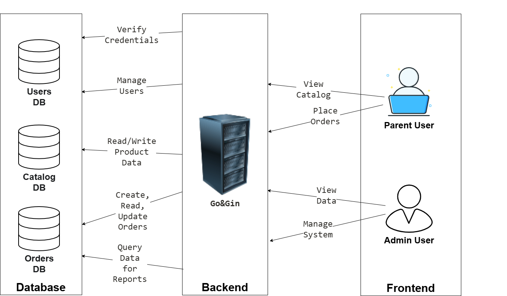

# K. Motzkin Student's Book Management

  

**High-Level Design**

---

## Table of Contents

1.  [User Stories](#1-user-stories)
    * [1.1. General Project Description](#11-general-project-description)
    * [1.2. User Story List](#12-user-story-list)
    * [1.3. Use Case Diagram](#13-use-case-diagram)
    * [1.4. Sequence Diagram](#14-sequence-diagram)
    * [1.5. Task Breakdown & Acceptance Criteria](#15-task-breakdown--acceptance-criteria)
2.  [Architecture](#2-architecture)
    * [2.1. Alternatives & Discussion](#21-alternatives--discussion)
    * [2.2. Deployment Diagram](#22-deployment-diagram)
    * [2.3. CI/CD Plan](#23-cicd-plan)
3.  [Risk Management](#3-risk-management)
    * [3.1 POC Recognition](#31-poc-recognition)
    * [3.2 Risk Management Table](#32-risk-management)

---

## 1. User Stories

### 1.1. General Project Description

This project tackles the development of an interface and a database infrastructure necessary for said interface for the **Kiryat Motzkin municipality.** The main purpose of our system is to provide an organized, centralized **way for parents to acquire the required school equipment** in a cheaper manner thanks to showing the otherwise inaccessible or unavailable discounts while also giving the data necessary for cheaper bulk purchases.

The project is a municipal initiative, and **our team is responsible for building the entire system.** The municipality will take responsibility for the interface and the database behind it, creating and providing content, and handling the maintenance and operation of the system after the course is complete.

Our team will not be responsible for developing the payment and clearing system. Instead, the team would build the interface that leads up to the purchase as well as the backend and database handling, at which point the user would be handed off to a **secure, external payment API**.

The system will provide two primary user stories:
* **Parents View:** Allows parents to find their children’s equipment lists and select the items for purchase.
* **Municipality View:** Allows municipal staff to add and manage the equipment lists and the items available in the internet store.

### 1.2. User Story List

#### Parent Stories:
* **As a parent**, I want to **find the equipment list** by providing my child’s school and class, so I can view the correct items we need him to have.
* **As a parent,** I want to view all required shirts and equipment in **one organized list**, so I can easily track what I need to purchase.
* **As a parent,** I want to **select the items I wish to purchase** and see them in a single, summed-up list, so I can organize my order.
* **As a parent,** I want to be able to **register for the website**, so I can be sure my data and order history are **stored securely**.
* **As a parent,** I want to complete my purchase using an external secure payment API, so I can **trust that my financial details are safe**.
* **As a parent**, I want to log out of my account, so I can **ensure my session is secure on shared devices.**
* **As a parent**, I want to view my previous orders, so I can **track purchases I’ve made in the past.**
* **As a parent**, I want to **contact customer support**, so I can get help with issues regarding orders, payments, or system use.
* **As a parent,** I want to **adjust accessibility settings** such as language and font size, so the system is easier for me to use.

#### Municipality Admin Stories:
* **As a Municipality Admin**, I want to add and edit equipment lists for each specific class and school, so I can **offer the correct, up-to-date requirements to parents.**
* **As a Municipality Admin**, I want to add and manage the equipment in the internet store, so I can **control the available items**, and update prices as agreed with suppliers.
* **As a Municipality Admin**, I want to log in to a secure admin panel, so I can **manage the system’s content through a secure interface.**
* **As a Municipality Admin**, I want to **register a new admin** account, so additional staff can manage the system.
* **As a Municipality Admin,** I want to edit suppliers, so I can **keep supplier details up to date.**
* **As a Municipality Admin,** I want to view the list of all suppliers, so I can **verify, manage, or update supplier partnerships.**
* **As a Municipality Admin,** I want to log out of my account, so I can **maintain secure access control.**
* **As a Municipality Admin,** I want accessibility settings (language & font size), so I can **configure the UI** according to my preferences.

### 1.3. Use Case Diagram

### 1.4. Sequence Diagram

#### Municipality Admin Diagram:

#### Parent Diagram:

### 1.5. Task Breakdown & Acceptance Criteria

#### Parent Stories

**Register/Login/Logout**
* **Tasks:**
    * Add registration form
    * Connect to Auth DB
    * Validate required fields
* **Acceptance Criteria:**
    * Login succeeds with valid data
    * Proper access control
    * User stored in Auth DB

**Complete purchase via external payment**
* **Tasks:**
    * Integrate external payment API
    * Redirect user to payment page
    * Handle confirmation callback
    * Notify the suppliers
* **Acceptance Criteria:**
    * Successful payment updates order
    * User receives confirmation

**Find equipment list**
* **Tasks:**
    * Add School/Class selection UI
    * Implement backend endpoint for list retrieval
    * Connect frontend to backend
* **Acceptance Criteria:**
    * User enters school/class
    * System returns correct equipment list

**Customer Support**
* **Tasks:**
    * Add support page or contact form
    * Direct to email/website/phone
* **Acceptance Criteria:**
    * Accessible methods of contact

**Accessibility (Language + Font Size)**
* **Tasks:**
    * Add settings UI
    * Implement multilingual frontend
    * Implement font scaling
    * Store user preferences
* **Acceptance Criteria:**
    * User can change language
    * User can change font size
    * Settings persist between sessions

#### Municipality Admin Stories

**Manage equipment lists**
* **Tasks:**
    * Add admin UI for equipment lists
    * Implement add/edit endpoints
    * Save data to Equipment DB
* **Acceptance Criteria:**
    * Admin can add/update lists
    * Changes appear for parents

**Manage store items**
* **Tasks:**
    * Add item management UI
    * Store items' inventory is added to the Equipment DB
* **Acceptance Criteria:**
    * Admin can create/edit items
    * Updated inventory visible to parents

**View organized list**
* **Tasks:**
    * Render equipment in grouped UI
    * Add sorting & display formatting
* **Acceptance Criteria:**
    * The list displays all items clearly
    * User can view without errors

**Admin panel login/logout**
* **Tasks:**
    * Add login form
    * Validate credentials via Auth DB
* **Acceptance Criteria:**
    * Correct credentials allow login
    * Incorrect ones show an error
    * Proper access control

**Admin Registration**
* **Tasks:**
    * Add admin registration UI
    * Validate roles
* **Acceptance Criteria:**
    * Admin accounts can be created securely

**Admin Accessibility**
* **Tasks & Criteria:** Similar to parent accessibility.

---

## 2. Architecture

### 2.1. Alternatives & Discussion

After **considering various alternatives** for building our application, this section outlines our proposed technology selections. We will discuss each choice and explain why it is the **optimal fit for the project's goals.**

#### 1. Frontend

* **Our Choice:** Next.js.
* **Rationale:** Next.js is a modern framework built on top of React. We considered **React.js** (requires building routing/SSR from scratch) and **Angular** (steeper learning curve). We chose Next.js for its built-in **Server-Side Rendering (SSR)**.
* **Benefits:**
    1.  **Faster Load Times:** Users see a complete, interactive page almost instantly.
    2.  **Improved Link Sharing:** Shared links (e.g., on WhatsApp) show correct previews/titles.
    3.  **Greater Reliability:** Reduces client-side rendering errors on older devices.

#### 2. Backend

* **Our Choice:** Go (Golang) with Gin framework.
* **Rationale:** We considered **Python (Django/Flask)** and **Node.js**. However, Go was chosen for:
    1.  **High Performance:** compiled language, making the API extremely fast.
    2.  **Efficiency:** Lightweight resource usage, ideal for public service projects handling many users.

#### 3. Database

* **Our Choice:** PostgreSQL.
* **Rationale:** We needed a relational database (SQL) because our data is structured and connected. We considered **NoSQL**, but it would add complexity for managing relationships manually.
* **Benefits:**
    1.  **Data Integrity:** Strict structure ensures consistency (e.g., orders must be linked to parents).
    2.  **Powerful Queries:** Ability to perform complex data retrieval easily.

### 2.2. Deployment Diagram

**Expected deliverables:**
* Container per service (API Server, DB, other services TBD)
* Docker compose file to spin up/down the system.

### 2.3. CI/CD Plan

Our approach focuses on ensuring code quality through **Continuous Integration (CI)** and aligning the final product with the client's vision through a **structured feedback cycle**.

1.  **Continuous Integration (CI) for Code Quality:**
    * Integrate new code frequently.
    * Run automatic tests on every integration.
    * Applies to backend, parent frontend, and admin frontend.

2.  **Delivery Strategy: An Iterative Feedback Loop:**
    * **Development Sprints:** 2-3 week cycles focusing on specific features.
    * **Client Review Meetings:** Demo new features and gather feedback.
    * **Integrating Feedback:** Use feedback to plan the next sprint.

---

## 3. Risk Management

### 3.1 POC Recognition

To best define the minimal requirements for the final product, we will specify the key features the final product should contain:

1.  **Municipality view**
    * The municipality will be able to add different equipment lists for each and every class in the education system of K. Motzkin.
    * The municipality will be able to add equipment to an internet store as agreed with suppliers.
2.  **Parents view**
    * The parents will be able to find the equipment gear of their different children by choosing their respective class and sum it up to a one organized list.
    * The parents will be able to purchase the required equipment using the internet store.
3.  **Security**
    * Both the municipality and the parents will be able to register on the website without fear for their privacy - the data will be securely stored.
    * All the purchases on the website will be secured, thanks to using external, reputable APIs for credit card payment.

### 3.2 Risk Management

| ID | Risk | Description | Likelihood | Impact | Mitigation Strategy |
| :--- | :--- | :--- | :--- | :--- | :--- |
| 1 | Data Accuracy Risk | The list of required books and equipment per class may be incomplete or outdated. | Medium | High | Establish direct communication with schools to obtain up-to-date data before each school year. |
| 2 | Integration with External Vendors | Online purchasing requires integration with book and equipment suppliers, which may fail or change APIs. | Medium | Medium | Use well-documented APIs and modular integration layers. Define clear contracts and fallback mechanisms. |
| 3 | Security and Privacy | The system handles personal data of students and parents. | High | High | Implement secure authentication, encrypt sensitive data, and comply with privacy regulations. Perform regular security testing. |
| 4 | Scalability and Performance | The system may experience heavy load before the start of the school year. | Medium | High | Use scalable cloud infrastructure, caching mechanisms, and load testing before deployment. |
| 5 | User Adoption Risk | Parents may not adopt the system or prefer traditional purchasing methods. | Medium | Medium | Provide a simple and intuitive user interface. Collaborate with the municipality to promote the system. |
| 6 | Technical Failure Risk | System downtime or critical failure. | Medium | High | Implement monitoring and alerting systems, automated backups, and thorough testing (unit, integration, system). |
| 7 | Project Schedule Risk | Delays in development or data collection may postpone deployment before the school year. | Medium | High | Define a realistic timeline, use Agile development with milestones, and maintain regular meetings. |
| 8 | Budget/Resource Limitations | Limited time or manpower among the student team may affect system quality. | Medium | Medium | Prioritize essential features (MVP first), use open-source tools, and maintain clear task division. |
| 9 | Legal and Compliance Risk | Misuse of copyrighted book data or failure to comply with purchasing regulations. | Low | High | Coordinate with the municipality’s legal advisors and ensure proper licensing for all digital content. |
| 10 | Data Loss Risk | Data (book lists, user info, purchase history) might be lost due to a system failure. | Low | High | Implement regular database backups, use cloud storage with redundancy, and test data recovery procedures. |